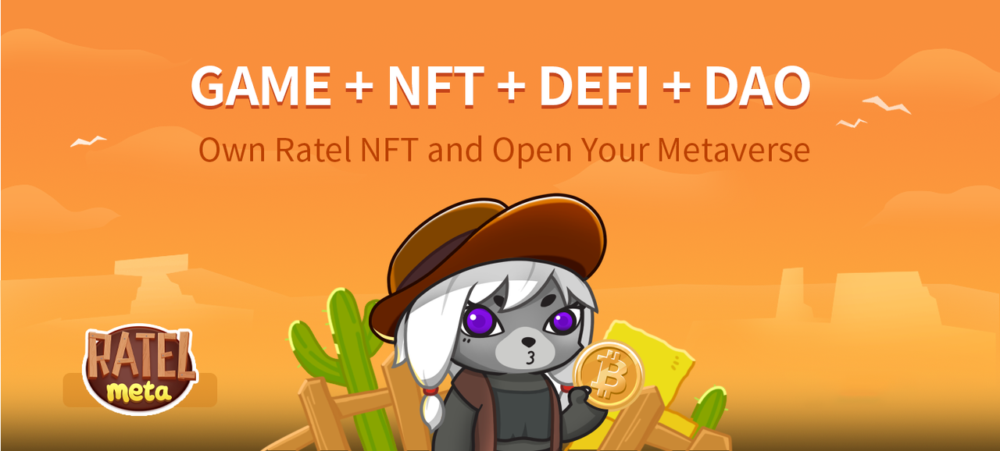

# Ratel NFT

Ratel NFT is the ticket for MetaRatel, users with Ratel NFTs need to have both female and male NFTs to breed Baby Ratel, which can be traded on the platform's NFT marketplace.

.png>)

1. In-game earnings can only be withdrawn at 14-day intervals
2. NFT can‘t participate in the game when shelfed in the trading market, and HGRT are zeroed out after NFT been sold
3. There are six NFT attributes, each with a maximum value of 100 and a minimum value of 40. The overall maximum value is 600 and the minimum value is 240, with the following attributes: Attack, Defense, Dexterity, Luck, Strength and Wisdom.
4. Probability of obtaining different attributes of NFT：
   * White: Common. 90% probability of having an overall attribute value between 240-360 (9,000 total)
   * Blue: Rare. 9.5% probability of having an overall attribute value between 361-480 (950 total)
   * Purple: Legendary. 0.5% probability of having an overall attribute value between 481-600 (50 total)
5. Ratel is divided into Baby Ratel, Genesis Ratel, Offspring Ratel
6. Total number of Ratel issued is 10,000
   * 3000 pre-sales via whitelist at 0.3BNB and 6,000 public sale at 0.4BNB
   * 600 reserved for the project team
   * 400 reserved fro partners
