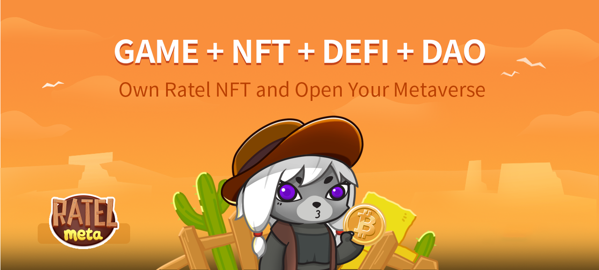

# Introduction to MetaRatel

MetaRatel is a casual game aggregation platform with NFT at its core, creatively bundling NFT with games to connect players and games. Ratel Land owners can choose to deploy or create their own games; players can earn revenue from a variety of gaming experiences; game developers can connect their games to the platform. Both parties help to create a good ecosystem. The platform will evolve into a metaverse gaming social platform based on games, allowing players to play, interact, share, create and earn revenue in MetaRatel through the advantages of true ownership, digital scarcity, profitability and interoperability brought by blockchain technology, making it a part of their lives.&#x20;

MetaRatel is a decentralised gaming autonomy platform that distributes the vast majority of the platform's revenue to its users, promoting players, the platform and game developers to stand together and enrich the content of the platform. Players with Governance Coin (HB) can participate in the governance of the platform community and interact with each other at the same time. Platform Operators and game developers can earn revenue from the services or products they provide, putting more effort into platform maintenance and game production on a win-win basis, thus creating a virtuous ecology.
